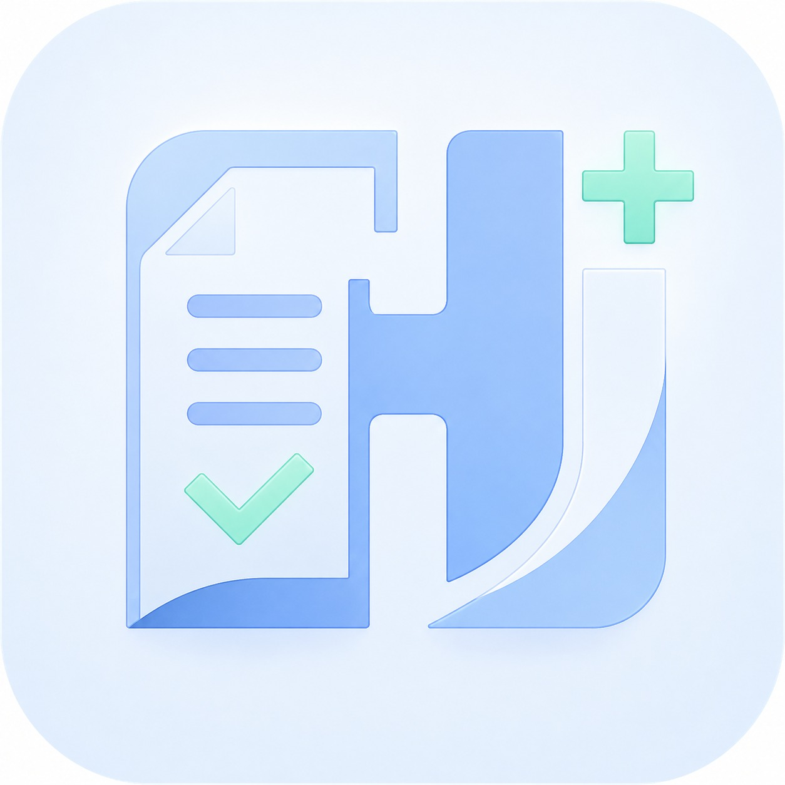

<p align="center">
  
</p>

<h1 align="center">Hakeem — حكيم</h1>

<p align="center">
  <em>A patient-owned medical history organizer that transforms scattered medical records into a structured, chronological Medical CV.</em>
</p>

<p align="center">
  
  
  
</p>
<p align="center">
  
  
  
</p>
<p align="center">
  
  
  
  
  
</p>

---

## 📖 Overview

**Hakeem** (Arabic: حكيم — "wise") is a cross-platform mobile application that puts patients in control of their medical history. Patients upload medical documents (prescriptions, lab reports, scans, discharge summaries, clinical notes), and Hakeem uses AI-powered extraction to parse them into structured, verified medical records. Approved records are compiled into a sharable **Medical CV** — a professional, chronological summary of the patient's health profile.

The patient always remains in full control: they review, confirm, or correct every piece of extracted data before it becomes part of their official profile. The Medical CV can be kept private, downloaded as a PDF, or shared externally with doctors via secure, time-limited preview links.

> [!IMPORTANT]
> **Hakeem is not a diagnostic or treatment tool.** It organizes medical information but does not replace professional medical consultation.

---

## ✨ Features

<details>
<summary><b>🏠 Home Dashboard</b></summary>

- **Medical Profile Card** — At-a-glance view of the patient's profile with total document count.
- **Upcoming Appointment Card** — Highlights the next scheduled appointment from the reminders system.
- **Pending Access Requests Banner** — Alerts the patient when doctors have requested access to their records.
- **Quick Actions Grid** — One-tap shortcuts to Documents, Upload, Access Requests, Medical CV, and Reminders.
- **Recent Activity Feed** — Shows the latest reminders pulled from the local SQLite database.

</details>

<details>
<summary><b>📄 Medical Document Management</b></summary>

- **Document Upload** — Upload documents via camera or file picker. Supports images (JPG, PNG, WebP, HEIC) and PDF files. Sent to the backend as multipart `FormData`.
- **Document Types** — Prescriptions, Lab Reports, Medical Scans, Discharge Summaries, Clinical Notes.
- **AI Extraction & Polling** — After upload, the app polls the backend (`/documents/{id}/extracted-fields`) for AI-extracted structured data with configurable intervals and max attempts.
- **Document List** — Paginated, filterable list of all uploaded documents with status badges (Completed, Processing, Failed).
- **Document Detail View** — Full detail screen with zoomable image viewer (ScrollView-based zoom up to 4×), document metadata, status indicators, and an "Open in Browser" fallback.
- **Secure Image Loading** — Automatic HTTP → HTTPS URL conversion to comply with mobile platform cleartext traffic restrictions.

</details>

<details>
<summary><b>🕐 Medical Timeline</b></summary>

- **Chronological Record View** — All medical records displayed in a visual timeline, grouped by year with connecting node lines.
- **Filter Chips** — Filter records by type (Medications, Allergies, Conditions, Lab Results, Surgeries, Visits, etc.).
- **Search** — Real-time text search across all medical records.
- **Pull-to-Refresh** — Refresh records from the backend with swipe-down gesture.
- **Record Detail** — Tap any timeline item to view full extracted fields and source document references.

</details>

<details>
<summary><b>📋 Medical CV</b></summary>

- **CV Generation** — The backend generates a structured, chronological Medical CV from the patient's approved records.
- **Version Management** — View all CV versions with status tracking (Draft, Approved, etc.).
- **PDF Download** — Download any CV version as a PDF document.
- **Secure Sharing** — Generate time-limited preview links (24h, 7d, 30d, or custom) to share the Medical CV with doctors or healthcare providers.
- **Share Link Modal** — Copy the generated link or share it via the native share sheet.

</details>

<details>
<summary><b>🤖 AI-Powered Patient Chat (HBot)</b></summary>

- **Conversational Interface** — Full chat UI with message bubbles, typing indicators, and auto-scrolling.
- **Medical Context Awareness** — The chatbot uses the patient's approved medical records as context via the `/medical-intelligence/chat` endpoint.
- **Formatted Responses** — Rich message formatting for assistant responses including markdown rendering.
- **Keyboard Integration** — Uses `react-native-keyboard-controller` for a smooth, native-feeling chat experience with `KeyboardChatScrollView` and `KeyboardStickyView`.
- **Safety Guardrails** — Responses remain grounded in the patient's records and do not provide diagnosis, treatment recommendations, or unsupported medical claims.

</details>

<details>
<summary><b>⏰ Smart Reminders & Alarms</b></summary>

- **Reminder Types** — Medication, Appointment, and Lab Test reminders with dedicated creation forms.
- **Medication Reminders** — Configurable frequency (Daily, Weekly, Monthly), duration (Lifelong or Finite), multiple daily doses with individual times, meal relation tracking (Before/After Breakfast/Lunch/Dinner/Snack), and delivery mode selection (Notification or Alarm).
- **Appointment Reminders** — Set reminders for upcoming doctor visits with provider name, location, and appointment date/time.
- **Lab Test Reminders** — Schedule follow-up lab reminders with test name, date, time, and optional notes.
- **Swipeable Cards** — Swipe-to-edit and swipe-to-delete reminder cards with gesture handling.
- **Segmented Control Filters** — Filter reminders by type (All, Medication, Appointment, Lab Test).
- **Full-Screen Alarm UI** — Dedicated alarm screen with looping vibration, live clock, dismiss/snooze actions, and hardware back button blocking.
- **Native Alarm Engine** — Custom `AlarmEngine` service with native clock alarm scheduling via a custom Expo config plugin (`withClockAlarm.js`), supporting exact alarms on Android.
- **Reminder Sync Service** — Routes reminders to either `expo-notifications` (for regular notifications) or the native alarm system based on the `deliveryMode` setting.
- **Local SQLite Storage** — All reminders are persisted locally using `expo-sqlite` with a full migration system, supporting offline access and multi-user device scenarios.

</details>

<details>
<summary><b>🔐 Doctor Access Requests</b></summary>

- **Access Request Management** — View, approve, or reject doctor access requests with filter chips (Pending, Active, Rejected, All).
- **One-Time Access Codes** — Approved requests generate a one-time code with an expiration timestamp, displayed in a dedicated modal.
- **Access Revocation** — Revoke previously granted doctor access at any time.
- **Push Notification Integration** — Receive push notifications when doctors request access; tapping the notification navigates directly to the Access Requests screen.
- **Secure Local Storage** — Approved access codes are stored locally using `expo-secure-store` for quick reference.

</details>

<details>
<summary><b>👤 Patient Profile & Settings</b></summary>

- **Profile Summary Card** — Displays the patient's name, email, and avatar.
- **Personal Info Management** — View and edit personal information with inline field editing via a modal.
- **Change Password** — Secure password change flow.
- **Delete Account** — Account deletion with confirmation flow.
- **Language Switcher** — Switch between Arabic, English, or Auto (system language) with real-time UI update. Saved to `AsyncStorage` for persistence.
- **Help & Privacy Screens** — Dedicated Help/FAQ and Privacy Policy screens.
- **Logout** — Clears all tokens, unregisters push token from backend, resets all Zustand stores, and navigates to login.

</details>

<details>
<summary><b>🔑 Authentication & Security</b></summary>

- **Login** — Email/password authentication with JWT access token + refresh token.
- **Registration** — Full registration flow with form validation.
- **Forgot/Reset Password** — Password recovery via email with a reset code flow.
- **Token Management** — JWT-based auth with automatic token refresh, expiry detection (with a 10-second pre-expiry buffer), and refresh lock to prevent race conditions.
- **Session Persistence** — Tokens stored securely using `expo-secure-store`. On app launch, the stored token is verified and refreshed if needed.
- **Force Logout** — Automatic forced logout on unrecoverable 401 responses, with global logout guard to prevent duplicate logout calls.

</details>

<details>
<summary><b>🔔 Push Notifications</b></summary>

- **Expo Push Notifications** — Full integration with `expo-notifications` for remote push notifications.
- **Backend Token Registration** — Device push tokens are registered with the backend via `PUT /patient/push-devices` including platform and language preferences.
- **Auto Re-Registration** — Push tokens are automatically re-registered with the backend after every successful token refresh to maintain continuity.
- **Cold-Start Navigation** — Uses `Notifications.useLastNotificationResponse()` hook to handle notification taps that open the app from a killed state.
- **Smart Deduplication** — In-memory `Set` prevents duplicate notification handling across hot reloads.
- **Cleanup on Logout** — Push tokens are unregistered from the backend and cleared from local storage on logout.

</details>

<details>
<summary><b>🌍 Internationalization (i18n)</b></summary>

- **Full Arabic & English Support** — Every screen, label, button, and message is translated.
- **Complete RTL Layout** — All layouts adapt for right-to-left rendering in Arabic, including flex direction reversal, text alignment, icon positioning, and margin/padding adjustments.
- **14 Translation Namespaces** — `onboarding`, `onboarding2`, `onboarding3`, `common`, `add`, `home`, `profile`, `timeline`, `medicalCv`, `reminders`, `auth`, `tabs`, `chatbot`, `accessRequests`.
- **Locale-Aware Formatting** — Dates, times, and day names format according to the active locale (`ar-EG` / `en-US`).
- **Language Detector** — Auto-detects device language on first launch via `expo-localization`, with user override persisted to `AsyncStorage`.

</details>

<details>
<summary><b>🎨 Onboarding</b></summary>

- **Multi-Step Walkthrough** — 3-step guided onboarding flow introducing the app's core value proposition.
- **First Launch Detection** — Onboarding is shown only on first launch, with completion state persisted.

</details>

---

## 🏗 Architecture

```
┌──────────────────────────────────────────────────────────┐
│                    React Native App                       │
│                                                          │
│  ┌─────────┐  ┌──────────┐  ┌───────────┐  ┌─────────┐ │
│  │  Expo   │  │  Expo    │  │   Expo    │  │  Expo   │ │
│  │  Router │  │  SQLite  │  │   Secure  │  │  Notif. │ │
│  │  (Nav)  │  │  (Local) │  │   Store   │  │  (Push) │ │
│  └────┬────┘  └────┬─────┘  └─────┬─────┘  └────┬────┘ │
│       │            │              │              │       │
│  ┌────┴────────────┴──────────────┴──────────────┴────┐  │
│  │              Zustand State Management              │  │
│  │  (Profile, Reminders, Documents, MedicationDraft)  │  │
│  └────────────────────────┬───────────────────────────┘  │
│                           │                              │
│  ┌────────────────────────┴───────────────────────────┐  │
│  │            Axios API Client (lib/api)              │  │
│  │  • JWT Interceptor (auto-refresh on 401)           │  │
│  │  • Force logout guard (prevents duplicate 401s)    │  │
│  │  • 30s timeout                                     │  │
│  └────────────────────────┬───────────────────────────┘  │
└───────────────────────────┼──────────────────────────────┘
                            │ HTTPS
                            ▼
                ┌───────────────────────┐
                │   ASP.NET Core API    │
                │   hakeem1.runasp.net  │
                │                       │
                │  /auth    /refresh    │
                │  /profile             │
                │  /documents           │
                │  /medical-records     │
                │  /medical-cvs         │
                │  /medical-cv-versions │
                │  /medical-intelligence│
                │  /patient-access-req  │
                │  /doctor-access       │
                │  /patient/push-devices│
                └───────────────────────┘
```

---

## 🛠 Tech Stack

| Layer | Technology | Purpose |
|:---|:---|:---|
| **Framework** | React Native `0.86` + Expo SDK `57` | Cross-platform mobile development |
| **Language** | TypeScript `6.0` | Type-safe development |
| **Navigation** | Expo Router (file-based) | Screens, tabs, modals, deep linking |
| **Styling** | NativeWind `4.2` (TailwindCSS `3.4`) | Utility-first styling with `cn()` helper |
| **State Management** | Zustand `5.0` | Lightweight, performant stores |
| **HTTP Client** | Axios `1.19` | API communication with interceptors |
| **Local Database** | Expo SQLite | Offline reminder storage with migrations |
| **Secure Storage** | Expo Secure Store | JWT tokens, access codes |
| **Async Storage** | AsyncStorage | Language preference, onboarding state |
| **Push Notifications** | Expo Notifications | Remote & local push notifications |
| **Alarm System** | Custom native plugin (`withClockAlarm.js`) | Exact alarm scheduling on Android |
| **Localization** | i18next + react-i18next + expo-localization | Full Arabic/English with RTL |
| **Keyboard** | react-native-keyboard-controller | Native keyboard handling in chat |
| **Animations** | React Native Reanimated `4.5` | Gesture-driven animations |
| **Gestures** | React Native Gesture Handler | Swipe-to-delete, swipe-to-edit |
| **Icons** | HugeIcons + Lucide React Native | 54+ custom icon components |
| **Typography** | Plus Jakarta Sans + Inter | Custom font families (4 weights each) |
| **Forms** | React Hook Form | Form state management and validation |
| **Monitoring** | Expo Observe | Performance observability |
| **Formatting** | Prettier + prettier-plugin-tailwindcss | Code formatting with class sorting |

---

## 📂 Project Structure

<details>
<summary>Click to expand full project tree</summary>

```
hakeem/
├── app/                          # Expo Router file-based screens
│   ├── (auth)/                   # Authentication flow
│   │   ├── login.tsx             #   Email/password login
│   │   ├── register.tsx          #   Registration form
│   │   ├── forgot-password.tsx   #   Password recovery entry
│   │   └── reset-password.tsx    #   Password reset with code
│   ├── (onboarding)/             # First-launch onboarding
│   │   ├── index.tsx             #   Step 1
│   │   ├── step2.tsx             #   Step 2
│   │   └── step3.tsx             #   Step 3
│   ├── (tabs)/                   # Main tab navigation
│   │   ├── index.tsx             #   🏠 Home dashboard
│   │   ├── timeline.tsx          #   🕐 Medical timeline
│   │   ├── chatbot.tsx           #   🤖 AI patient chat (HBot)
│   │   ├── medical-cv/           #   📋 Medical CV list & detail
│   │   ├── profile/              #   👤 Profile, settings, password, privacy
│   │   └── add/                  #   ➕ Document upload flow
│   ├── documents/                # Document list & detail screens
│   ├── reminders/                # Reminder list, creation, scheduling
│   ├── record-detail/            # Medical record detail view
│   ├── access-requests.tsx       # Doctor access request management
│   ├── alarm-screen.tsx          # Full-screen alarm UI
│   └── _layout.tsx               # Root layout (fonts, assets, notifications)
│
├── components/                   # Reusable UI components
│   ├── ui/                       # Base components (Button, InputField, BackButton, etc.)
│   ├── home/                     # Home screen widgets (ProfileCard, QuickActions, etc.)
│   ├── timeline/                 # Timeline nodes, cards, filters, skeletons
│   ├── medical-cv/               # CV cards, banners, modals, skeletons (15 components)
│   ├── reminders/                # Reminder cards, forms, modals (17+ components)
│   │   └── forms/                # Type-specific forms (Medication, Appointment, Lab Test)
│   ├── chatbot/                  # FormattedAssistantMessage renderer
│   ├── access-requests/          # AccessRequestCard, FilterChips
│   ├── upload/                   # ProcessingView, ProcessingStepItem
│   ├── personal-info/            # ProfileSummaryCard, PersonalInfoCard, EditModal
│   ├── icons/                    # 54 custom SVG icon components with solid/outline variants
│   └── LanguageSwitcher.tsx      # Language toggle component
│
├── lib/                          # Core utilities & services
│   ├── api/                      # API layer
│   │   ├── client.ts             #   Axios instance, JWT interceptors, force logout
│   │   ├── auth.ts               #   Login, token refresh, token verification
│   │   ├── documents.ts          #   Upload, poll extraction, list, detail
│   │   ├── medical-records.ts    #   List, search, detail
│   │   ├── medical-cv.ts         #   List CVs, detail, PDF download, preview links
│   │   ├── chatbot.ts            #   AI chat endpoint
│   │   ├── access-requests.ts    #   CRUD for doctor access requests
│   │   ├── notifications.ts      #   Push token register/unregister
│   │   └── profile.ts            #   Get/update profile, logout
│   ├── theme/                    # Design tokens
│   │   ├── colors.ts             #   Full color palette (8 scales × 10 shades)
│   │   └── fonts.ts              #   Font family definitions
│   ├── push-notifications.ts     # Expo push notification registration & handlers
│   ├── alarm-engine.ts           # Native alarm scheduling & foreground notification handling
│   ├── alarm-service.ts          # Alarm sound/vibration control
│   ├── reminder-sync-service.ts  # Routes reminders to notification or alarm system
│   ├── reminder-utils.ts         # Reminder computation helpers
│   ├── reminder-validation.ts    # Form validation for reminders
│   ├── reminder-selectors.ts     # Zustand selector helpers
│   ├── medical-cv-utils.ts       # CV utility functions
│   ├── profile-utils.ts          # Profile data helpers
│   ├── access-codes-storage.ts   # Secure local storage for access codes
│   ├── storage.ts                # Expo Secure Store wrapper (get/set/delete)
│   └── utils.ts                  # cn() class name merge utility
│
├── store/                        # Zustand state stores
│   ├── useProfileStore.ts        # Patient profile state
│   ├── useReminderStore.ts       # Reminders CRUD + SQLite sync
│   ├── useDocumentStore.ts       # Document upload state
│   └── useMedicationDraftStore.ts# Multi-step medication reminder draft
│
├── hooks/                        # Custom React hooks
│   ├── useDocuments.ts           # Document list fetching & pagination
│   ├── useMedicalCv.ts           # Medical CV list & detail fetching
│   ├── useMedicalRecords.ts      # Medical records with filtering & search
│   └── useMedicalRecordDetail.ts # Single record detail fetching
│
├── database/                     # SQLite database layer
│   ├── index.ts                  # Database initialization & singleton
│   ├── migrations.ts             # Schema migration system
│   ├── reminders.ts              # Reminder CRUD operations
│   └── device-users.ts           # Multi-user device support
│
├── types/                        # TypeScript type definitions
│   ├── reminder.ts               # Reminder, Schedule, DeviceUser types
│   ├── document.ts               # Document upload & response types
│   ├── medical-record.ts         # Medical record types
│   ├── medical-cv.ts             # Medical CV, Version, PreviewLink types
│   ├── profile.ts                # Profile types
│   ├── chatbot.ts                # Chat request/response types
│   └── ui.ts                     # UI component prop types
│
├── localization/                 # i18n translations
│   ├── i18n.ts                   # i18next configuration & language detector
│   ├── EN/                       # English translations (14 namespace files)
│   └── AR/                       # Arabic translations (14 namespace files)
│
├── plugins/                      # Custom Expo config plugins
│   └── withClockAlarm.js         # Android exact alarm permissions & native alarm support
│
├── assets/
│   ├── fonts/                    # Plus Jakarta Sans + Inter font files
│   └── images/                   # App icons, splash, empty states, illustrations
│
├── app.json                      # Expo configuration
├── eas.json                      # EAS Build profiles (development, preview, production)
├── tailwind.config.js            # NativeWind/TailwindCSS configuration
├── global.css                    # Global CSS styles
├── tsconfig.json                 # TypeScript configuration
└── package.json                  # Dependencies & scripts
```

</details>

---

## 🚀 Getting Started

### Prerequisites

| Requirement | Recommended Version |
|:---|:---|
| Node.js | `22.13.x` LTS |
| Java Development Kit | JDK `17` |
| Android Studio | Current stable release |
| Android SDK Platform | Android 15 / API `35` |
| Android SDK Build-Tools | `36.0.0` |
| EAS CLI | `npm install -g eas-cli` |

### Installation

```bash
# 1. Clone the repository
git clone https://github.com/HakeemHQ/Mobile.git
cd Mobile

# 2. Install dependencies
npm install

# 3. Start the development server
npm run dev
```

### Running on Device / Emulator

```bash
# Android emulator
npm run android

# iOS simulator (macOS only)
npm run ios

# Or scan the QR code with Expo Go
npm run dev
```

> [!TIP]
> Make sure you have an Android emulator running or a physical device connected before running `npm run android`.

---

## 📦 Building for Production (EAS)

> [!WARNING]
> Always run EAS commands from the **project root directory** (`/Mobile`), not from inside the `/android` folder. Running from `/android` will cause a `ConfigError: package.json not found` error.

```bash
# Development build (with dev client)
eas build --profile development --platform android

# Preview build (internal distribution)
eas build --profile preview --platform android

# Production build (auto-incrementing version)
eas build --profile production --platform android
```

---

## 🔌 API Endpoints

The mobile app communicates with the **Hakeem ASP.NET Core API** at `hakeem1.runasp.net` over HTTPS.

<details>
<summary>Click to expand all endpoints</summary>

| Endpoint | Method | Purpose |
|:---|:---|:---|
| `/auth/login` | `POST` | User authentication |
| `/auth/register` | `POST` | User registration |
| `/auth/logout` | `POST` | Session logout |
| `/refresh` | `POST` | JWT token refresh |
| `/profile` | `GET` / `PATCH` | Patient profile |
| `/documents` | `GET` / `POST` | Document list & upload |
| `/documents/{id}` | `GET` | Document detail |
| `/documents/{id}/extracted-fields` | `GET` | AI extraction results |
| `/medical-records` | `GET` | Medical records (search, filter, pagination) |
| `/medical-records/{id}` | `GET` | Record detail |
| `/medical-cvs` | `GET` | Medical CV list |
| `/medical-cvs/{id}` | `GET` | Medical CV detail & versions |
| `/medical-cv-versions/{id}/pdf` | `GET` | Download CV as PDF |
| `/medical-cv-versions/{id}/preview-link` | `POST` | Generate shareable link |
| `/medical-intelligence/chat` | `POST` | AI chatbot |
| `/patient-access-requests` | `GET` | List access requests |
| `/patient-access-requests/{id}/approve` | `POST` | Approve request |
| `/patient-access-requests/{id}/reject` | `POST` | Reject request |
| `/doctor-access` | `GET` / `DELETE` | Manage doctor access |
| `/patient/push-devices` | `PUT` / `DELETE` | Push token management |

</details>

---

## 🛡️ Safety Boundaries

> [!CAUTION]
> Hakeem organizes medical information but does **not** replace professional medical consultation. The application must not diagnose diseases, recommend treatments, prescribe medication, modify doses, or generate unsupported medical claims.

AI-generated information must remain grounded in the patient's approved records. When information is missing or unclear, the system explicitly indicates uncertainty instead of guessing.

---

## 🎨 Design System

<details>
<summary>Click to expand design details</summary>

### Color Palette

| Scale | Default | Usage |
|:---|:---|:---|
| **Primary** | `#1A56DB` 🔵 | Main brand color, CTAs, active states |
| **Secondary** | `#0D9B6C` 🟢 | Success states, completed status |
| **Tertiary** | `#704CC3` 🟣 | Lab results, special categories |
| **Danger** | `#DC2626` 🔴 | Errors, failures, destructive actions |
| **Background** | `#F9FAFB` | App background |
| **Surface** | `#FFFFFF` | Cards, modals, elevated surfaces |
| **Text** | `#1F2937` | Primary text |
| **Text2** | `#6B7280` | Secondary/muted text |

Each scale includes 10 shades from `50` (lightest) to `900` (darkest).

### Typography

| Font Family | Weights | Usage |
|:---|:---|:---|
| **Plus Jakarta Sans** | Regular, Medium, SemiBold, Bold | Headings, titles, bold UI text |
| **Inter** | Regular, Medium, SemiBold, Bold | Body text, descriptions, form labels |

### Component Library

`Button` · `InputField` · `BackButton` · `InfoBanner` · `ListItem` · `ConfirmDetailsModal` · `SuccessModal` · `SuccessIcon` · `Onboarding` · `OnboardingHeader` · `FastAccessButton`

### Icon System

**54** custom icon components wrapping HugeIcons with solid/outline variant support.

</details>

---

## 👥 Target Users

| User | Description |
|:---|:---|
| **Patients** | Upload, organize, and share their medical history |
| **Caregivers** | Manage medical records on behalf of family members |

> [!NOTE]
> There is no dedicated doctor-facing interface in the current version. Doctors interact with patient data through the access request and one-time code system.

---

## 📄 License

This project is proprietary. All rights reserved by the **Hakeem** team.

---

<p align="center">
  <sub>Built with ❤️ by the Hakeem Team</sub>
</p>
